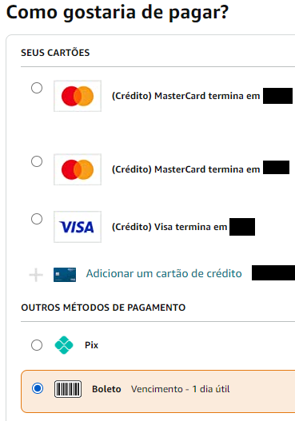
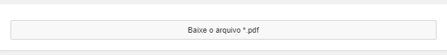
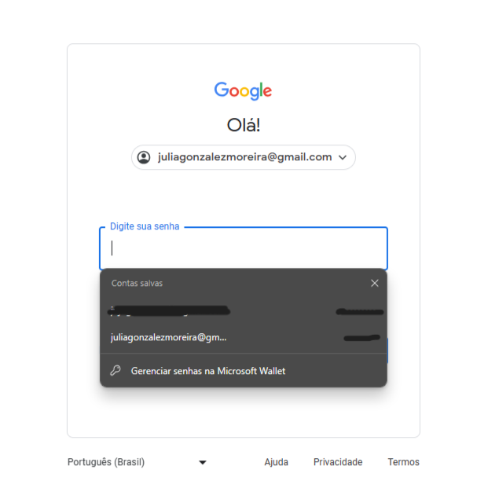
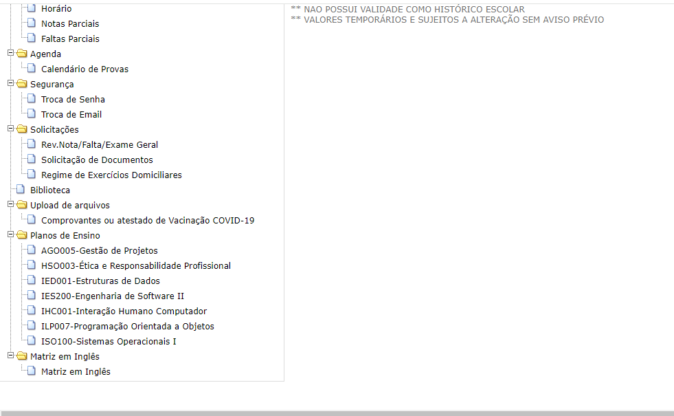
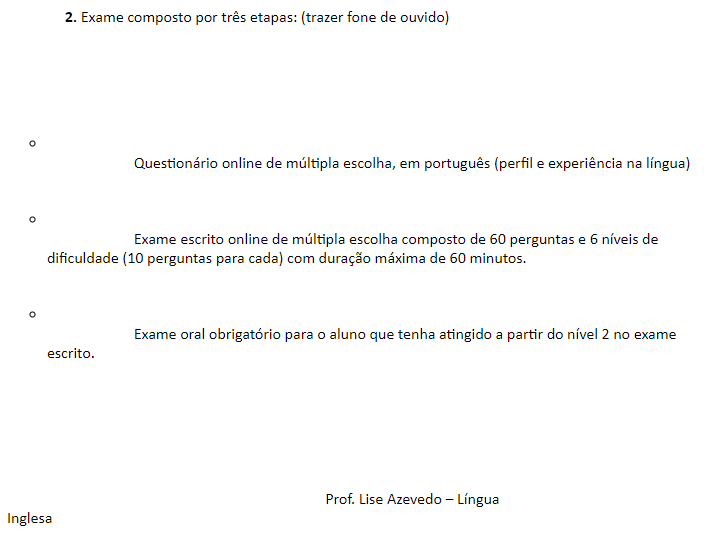
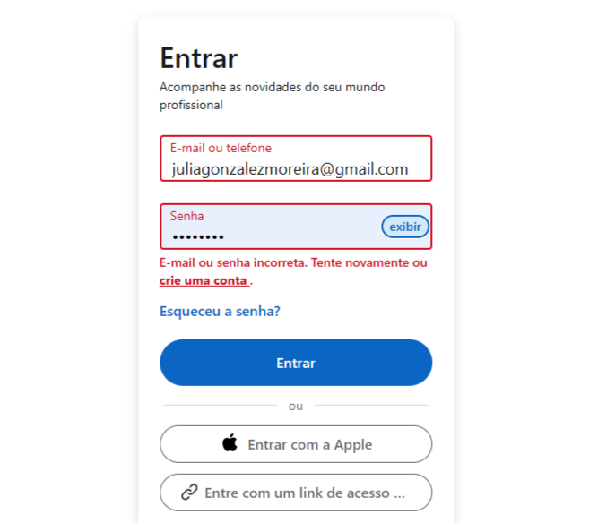

# Aula de Interação Humano Computador

## Aula 21/02/2024

### 1. Visibility of System Status
"O design deve sempre manter os usuários informados sobre o que está acontecendo, através de feedback apropriado dentro de um período de tempo razoável."

<em>O Spotify notifica o usuário que o link foi copiado.</em>

### 2. Match Between the System and the Real World
"O design deve falar a língua dos usuários. Use palavras, frases e conceitos familiares ao usuário, em vez de jargões internos. Siga as convenções do mundo real, fazendo com que as informações apareçam em uma ordem natural e lógica."

### 3. User Control and Freedom
"Os usuários geralmente executam ações por engano. Eles precisam de uma "saída de emergência" claramente marcada para deixar a ação indesejada sem ter que passar por um processo prolongado."

<em>O Pinterest possibilita ao usuário desfazer uma ação logo após ela ser feita</em>

### 4. Consistency and Standards
"Os usuários não devem ter que se perguntar se palavras, situações ou ações diferentes significam a mesma coisa. Siga as convenções da plataforma e do setor."

### 5. Error Prevention
"Os usuários geralmente executam ações por engano. Eles precisam de uma "saída de emergência" claramente marcada para deixar a ação indesejada sem ter que passar por um processo prolongado."

<em>O Word avisa o usuário que o arquivo não foi salvo e lhe dá a opção de salvar, evitando perder as alterações</em>

### 6. Recognition Rather than Recall
"Minimize a carga de memória do usuário tornando elementos, ações e opções visíveis. O usuário não deve ter que se lembrar de informações de uma parte da interface para outra. As informações necessárias para utilizar o desenho ou modelo (por exemplo, etiquetas de campo ou itens de menu) devem estar visíveis ou ser facilmente recuperáveis quando necessário."

<em>O Gmail (junto a Microsoft) tem salvas as contas e senhas já utilizadas junto com a foto de perfil do usuário, facilitando o reconhecimento e o login na conta. </em>

### 7. Flexibility and Efficiency of Use
"Os atalhos podem acelerar a interação para o usuário experiente para que o design possa atender tanto usuários inexperientes quanto experientes. Permita que os usuários personalizem ações frequentes."

### 8. Aesthetic and Minimalist Design
"As interfaces não devem conter informações irrelevantes ou raramente necessárias. Cada unidade extra de informação em uma interface compete com as unidades de informação relevantes e diminui sua visibilidade relativa."

### 9. Help Users Recognize, Diagnose, and Recover from Errors
"As mensagens de erro devem ser expressas em linguagem simples, indicar precisamente o problema e sugerir construtivamente uma solução."

<em>O LinkedIn alerta o usuário de que seu email ou senha está incorreto para que ele possa revisar as informações, além de dar as opções de recuperar senha, entrar de outra maneira ou criar uma conta. </em>

### 10. Help and Documentation
"É melhor se o sistema não precisar de nenhuma explicação adicional. No entanto, pode ser necessário fornecer documentação para ajudar os usuários a entender como concluir suas tarefas."

<em>O GitHub tem a sua documentação e um suporte disponíveis para auxiliar os usuários. </em>

### Link da matéria ⤵️
[10 Usability Heuristics for User Interface Design](https://www.nngroup.com/articles/ten-usability-heuristics/)
