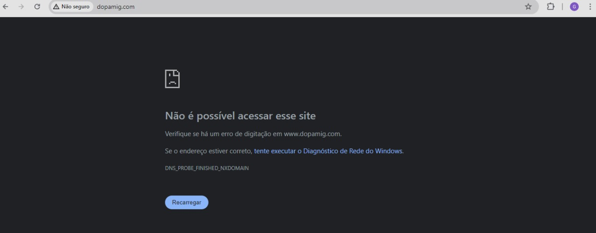
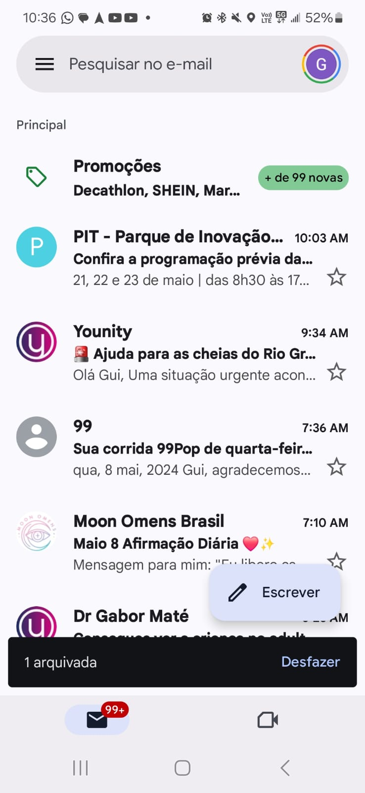
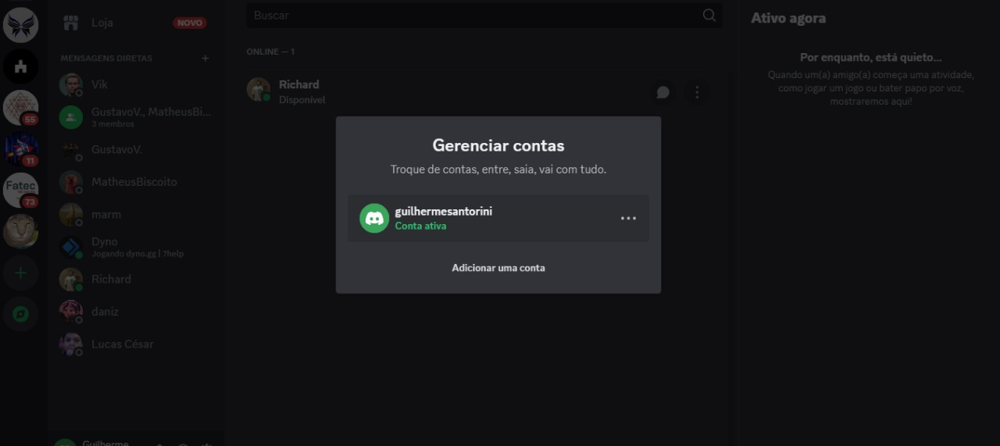
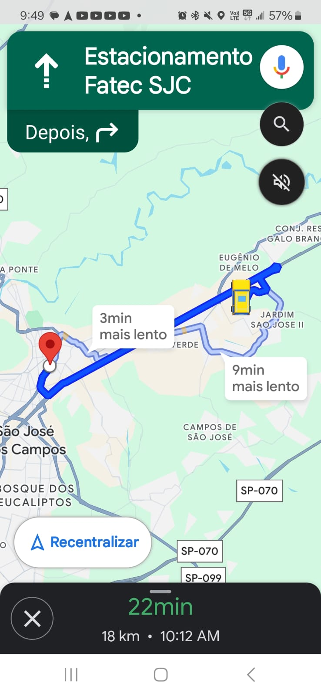
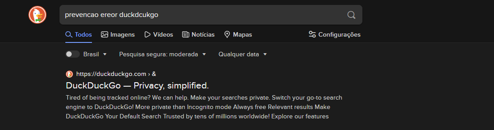

# Aula de Interação Humano Computador

## 10 Usability Heuristics

### 1. Visibilidade do status do sistema
"O design deve sempre manter os usuários informados sobre o que está acontecendo, através de feedback apropriado dentro de um período de tempo razoável."

<em>O Spotify notifica o usuário que o link foi copiado.</em>

### 2. Correspondência entre o sistema e o mundo real
"O design deve falar a língua dos usuários. Use palavras, frases e conceitos familiares ao usuário, em vez de jargões internos. Siga as convenções do mundo real, fazendo com que as informações apareçam em uma ordem natural e lógica."

### 3. Liberdade e controle do usuário
"Os usuários geralmente executam ações por engano. Eles precisam de uma "saída de emergência" claramente marcada para deixar a ação indesejada sem ter que passar por um processo prolongado."

<em>O Pinterest possibilita ao usuário desfazer uma ação logo após ela ser feita</em>

### 4.Consistência e padrões
"No fórum GUJ(Grupo de usuários Java), quando vamos responder um post, o botão para enviar a resposta sempre é da mesma cor, tamanho e texto. O elemento para cancelar a resposta sempre tem seus padrões:"

### 5. Prevenção de erros
"Os usuários geralmente executam ações por engano. Eles precisam de uma "saída de emergência" claramente marcada para deixar a ação indesejada sem ter que passar por um processo prolongado."

<em>O Word avisa o usuário que o arquivo não foi salvo e lhe dá a opção de salvar, evitando perder as alterações</em>

### 6. Reconhecer ao invés de lembrar
"Quando você entra em um produto do site da Locaweb é disponibilizado o caminho que você fez pra chegar até ele. Nós chamamos isso de breadcrumb."

<em>O Gmail (junto a Microsoft) tem salvas as contas e senhas já utilizadas junto com a foto de perfil do usuário, facilitando o reconhecimento e o login na conta. </em>

### 7. Flexibilidade e Eficiência
"Os atalhos podem acelerar a interação para o usuário experiente para que o design possa atender tanto usuários inexperientes quanto experientes. Permita que os usuários personalizem ações frequentes."

### 8. Estética e Design minimalista
"As interfaces não devem conter informações irrelevantes ou raramente necessárias. Cada unidade extra de informação em uma interface compete com as unidades de informação relevantes e diminui sua visibilidade relativa."

### 9. Auxiliar usuários a reconhecer, diagnosticar e recuperar erros
"Ao contrário do Google, o DuckDuckGo não incorpora uma forte heurística de prevenção de erros em sua função de busca. Isso significa que, ao digitar uma palavra incorreta, o DuckDuckGo pode não oferecer sugestões automáticas para corrigir possíveis erros de digitação. A ausência dessa heurística pode resultar em frustração para os usuários, especialmente aqueles propensos a erros ortográficos comuns."

<em>O LinkedIn alerta o usuário de que seu email ou senha está incorreto para que ele possa revisar as informações, além de dar as opções de recuperar senha, entrar de outra maneira ou criar uma conta. </em>

### 10. Ajuda e Documentação
"No formulário de pagamento do Walmart tem um campo pra preencher o código de segurança do cartão. Como não é algo muito óbvio, tem uma imagem próxima ao campo mostrando onde fica o código de segurança do cartão. Essa é uma boa forma de fazer uma documentação"

<em>O GitHub tem a sua documentação e um suporte disponíveis para auxiliar os usuários. </em>

### Link da matéria ⤵️
[10 Heurísticas de Nielsen]((https://rockcontent.com/br/blog/heuristicas-de-nielsen/))
